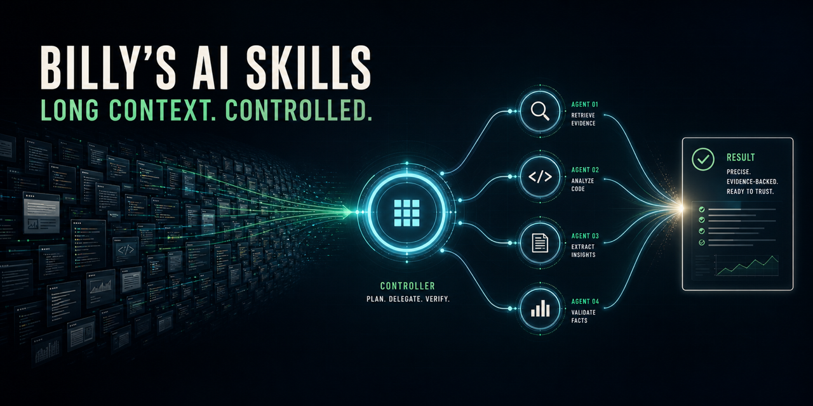
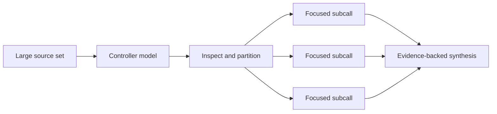
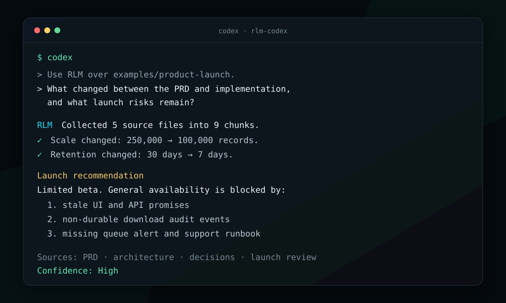

# Billy's AI Skills

[](https://github.com/wbratz/billys-ai-skills/actions/workflows/validate.yml)
[](https://github.com/wbratz/billys-ai-skills/releases/latest)
[](LICENSE)



Production-minded plugins for giving coding agents more reach without giving
them less discipline.

The flagship project is a cross-client implementation of Recursive Language
Model workflows for Claude Code and OpenAI Codex. It lets an agent work across
large repositories, document collections, logs, transcripts, and research
corpora while keeping the raw context outside the main conversation.

> **Status:** v0.1, experimental. Start with a dry run, use explicit budgets,
> and review generated analysis code before trusting it with sensitive context.

## Why RLM?

Normal agent workflows degrade when the source material is too large to hold in
one useful context window. RLM treats that material as an external environment.
A controller model inspects it with code, delegates focused questions over
chunks, and synthesizes the results.



This is useful for:

- cross-document questions and repository-wide audits
- long incident logs and transcripts
- research synthesis across many sources
- recovering signal when a normal agent conversation is running out of context

It is usually unnecessary for a narrow edit, one small file, or a question that
ordinary search can answer directly.

## See it work

The repository includes a fictional product-launch packet with deliberate
contradictions between its PRD, implementation, decision log, and launch
review. The demo executes the real Codex runner in dry-run mode, then shows a
recorded source-cited synthesis from a live workflow.



```bash
./demo/run.sh
```

The dry run needs only Python 3.11 or newer. It does not require model
credentials or spend API tokens. Inspect the
[`examples/product-launch/`](examples/product-launch/) corpus and the
[`recorded synthesis`](demo/expected-synthesis.md) directly.

## Plugin catalog

| Client | Plugin | What it adds |
| --- | --- | --- |
| Claude Code | `rlm` | Planned long-context analysis with setup checks, cost visibility, and a native fallback |
| Claude Code | `rlm-auto` | Conservative automatic routing, a configurable cost cap, and local decision evaluation |
| OpenAI Codex | `rlm-codex` | A tested Python runner with dry runs, bounded fanout, health checks, and local-model support |

## Install

Clone the repository once:

```bash
git clone https://github.com/wbratz/billys-ai-skills.git
cd billys-ai-skills
```

### OpenAI Codex

Add the marketplace:

```bash
codex plugin marketplace add ./openai
```

Then install `rlm-codex` from the marketplace. Full setup, health checks, local
model configuration, and runner examples are in the
[Codex guide](openai/docs/rlm-codex.md).

### Claude Code

Add the marketplace and install the base plugin:

```bash
claude plugin marketplace add ./claude
claude plugin install rlm@billys-ai-skills
```

For passive routing, also install:

```bash
claude plugin install rlm-auto@billys-ai-skills
```

The automatic router requires a small hook configuration. Follow the
[`rlm-auto` setup guide](claude/plugins/billys-rlm-auto/README.md) before
enabling it.

## Safety model

RLM expands an agent's ability to inspect source material, but it does not make
untrusted input safe.

- Use `--dry-run` before large jobs.
- Keep provider keys out of prompts, source files, and logs.
- Prefer a subprocess environment for generated Python.
- Set explicit cost, time, depth, and concurrency limits.
- Use local execution only with trusted context.
- Review outputs against cited source material.

See [SECURITY.md](SECURITY.md) for reporting and operating guidance.

## Repository map

```text
claude/     Claude Code marketplace, plugins, hooks, and registry
openai/     Codex marketplace, plugin, runner, tests, and documentation
ai_docs/    Research and implementation notes
scripts/    Cross-marketplace validation
```

Client-specific operating contracts live in
[`claude/CLAUDE.md`](claude/CLAUDE.md) and
[`openai/AGENTS.md`](openai/AGENTS.md).

## Validate

```bash
npm ci --prefix claude/tools
npm audit --prefix claude/tools --omit=dev
npm run validate --prefix claude/tools
python3 scripts/validate_repository.py
python3 -m unittest discover -s claude/plugins/billys-rlm-auto/tests -p "test_*.py" -v
python3 -m unittest discover -s openai/plugins/rlm-codex/tests -p "test_*.py" -v
```

See [CONTRIBUTING.md](CONTRIBUTING.md) for the complete contributor workflow.

Release history is documented in [CHANGELOG.md](CHANGELOG.md).

## License

[MIT](LICENSE)
